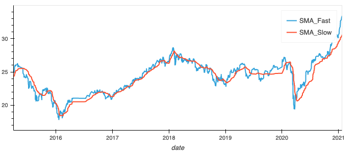
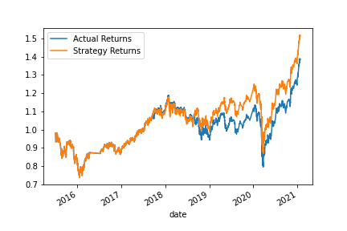
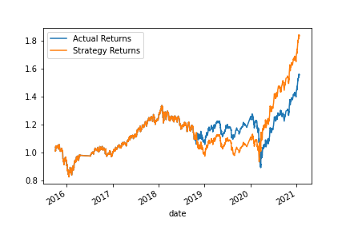
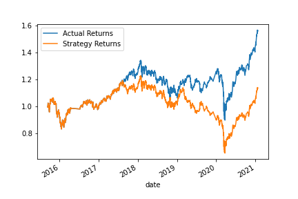
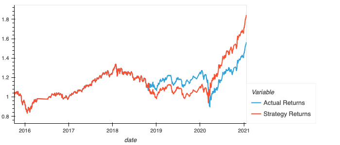

# ML-Algorithmic-Trading


Optimizing Trading Signals with Machine Learning

---

This jupyter notebook file includes:

- Algorithmic trading strategy that uses machine learning to automate trade decisions.
- Adjusted input parameters to optimize the trading algorithim.
- A Summary of 2 distinct machine learning models and a comparison of performance of tuned models to baseline model.

## Technologies

This project uses Python 3.7 with the following packages and modules:

-Pandas

-Numpy

-Pathlib

-Matplotlib

-Sklearn


## Installation Guide

This analysis was done with Pandas in Jupyter Lab. If the User wants to interact with the Machine Learning Model, first install the following:
  To get started using this application please go to [Python Download](https://www.python.org/downloads/) and select the version for your operating system. Then install the following libraries and packages.

``` sudo apt install python3-pip ```. This will install the pip that will make it easier to install the libraries.

``` pip install pandas ```

``` pip install numpy ```

``` pip install -U scikit-learn ```

``` python -m pip install -U pip ```

``` python -m pip install -U matplotlib ```


## Usage

The file of interest is labeled ``` machine_learning_trading_bot.ipynb ```


## Contributors

Stephen Thomas

[Trilogy Education Services](https://www.trilogyed.com/)

[UC Berkeley Extension ](https://extension.berkeley.edu/)


## License 

MIT
---

# Summary Evaluation Report

This report will explain and compare the different iterations of machine learning models that were built, trained and then optimized to return the greatest financial gains for the Algorithmic Trading Strategy that I have used.

- Baseline
First lets start with a summary of the Baseline model. The signals that I used to initiate a buy is (1) and a sell is (-1). We gave a signal of 1 to Actual Returns when they were equal to or greater than 0, and we gave a -1 to Actual Returns that were less than 0. We define Actual Returns as the percent change in closing price of whatever we are trading.
Using a rolling mean value with the rolling window set for 4 days gave me the Fast indicator and a rolling window of 100 days gave me a Slow indicator. These two indicators were my SMA indicators or Simple Moving Average indicators. They are the average price over the specified time period. We call them moving because they are plotted on a chart forming a line that moves with the average price change.



Here you can see the 2 Simple Moving Average indicators on the chart. Basically the trading strategy is when the percent change for the closing price goes up we buy in the hopes of the closing price continuing to go up, and when the percent change of the closing price goes down, we sell in the hopes that the price will continue to go down, taking advantage of the short term trends in price action.
A few parameters to note for the Baseline strategy are:
- SMA_Fast is set at 4 days
- SMA_Slow is set at 100 days
- Data for training the machine learning model was set at 3 months
- We used a SVM or Support Vector Method for its ability to discriminate between two classes, We wanted to be able to predict 1 or -1

## Results for Baseline



Here you can see that the Strategy Returns (orange) outperformed the actual returns (blue). The Algorithmic trading bot was profitable and because the machine learning algorithim was able to predict with a decent accuracy of 55%, the future signal and trade accordingly, we were in profit.
---

## Version_2
For Version_2 I have tried to optimize the machine learning training dataset by extending the training time. Another way to put it is I have increased the amount of data that we let the model train with. The goal was to increase the accuracy of the model so that we could potentially make more money.
In the Baseline we gave the model 3 months of data to train with. In Version_2 we will give the model 6 months of training data and see what that results with.
A few parameters to note for the Version_2 strategy are:
- SMA_Fast is set at 4 days
- SMA_Slow is set at 100 days
- Data for training the machine learning model was set at 6 months
- We used a SVM or Support Vector Method for its ability to discriminate between two classes, We wanted to be able to predict 1 or -1

## Results for Version_2



Here you can see that the Strategy Returns (orange) is in even more profit than the Actual Returns (blue), and so by increasing the training set from 3 months of data to 6 months of data, we have increased our profitablility. Awesome. Lets continue to optimize model and see if we can increase the Strategy Returns.
---

## Version_3
For Version_3 I will keep the training set at 6 months of data and also change the SMA_Slow and SMA_Fast parameters and see what occurs. 
A few parameters to note for the Version_2 strategy are:
- SMA_Fast is set at 21 days
- SMA_Slow is set at 200 days
- Data for training the machine learning model was set at 3 months
- We used a SVM or Support Vector Method for its ability to discriminate between two classes, We wanted to be able to predict 1 or -1

## Results for Version_3



Here you can see that by adjusting the SMA_Fast and SMA_Slow parameters we have significantly decreased our profitability for the Strategy Returns versus the Actual Returns. 
---

## Logistic Regression Model
I have also included a Logistic Regression Machine Learning Model to compare how accurate and profitable it was in predicting trading signals. 
A few parameters to note for the Version_2 strategy are:
- SMA_Fast is set at 4 days
- SMA_Slow is set at 100 days
- Data for training the machine learning model was set at 6 months
- We used a Logistic Regression Model for its ability to discriminate between binary outcomes, Yes/No, True/False, work well with LR Models.  We wanted to be able to predict 1 or -1, and so my hope was that a LR Model would be able to do this accuratly.

## Results for Logistic Regression Model


Here you can see that the Strategy Returns kept up with the Actual Returns for first 2 years, and then in the begining of 2018 the Strategy Returns deviated from the Actual Returns significantly, then came back and mirrored the Actual Returns in profitability for 2020 and 2021. This is interesting and could have been much much worse. All in all I am pleased with the LR Model. It was not ptrofitable but it also didn't loose money so thats a win.

## Conclusions:

It is clear that with the shorter windows for the SMA_Fast and SMA_Slow we get better results. As seen in the comparison between Version_2 and Version_3. My assumption is that we get a tighter trading strategy. What I mean by that is the price is fluctuating up and down while trending in general directions, and those directions change between up and down. With the SMA_Fast set at 4 days and the SMA_Slow set at 100 days, these parameters give the the machine learning model a closer representaion of actual price. We are using the SMA_Fast and SMA_Slow values as the features for the ML model. The model uses these values to train and predict.
It is also important to note that the Version_2 with the longer training dataset of 6 months outperformed the Baseline version with 3 months of training data. I am convinced that Version_2 is the most profitable model that I was able to optimize.


